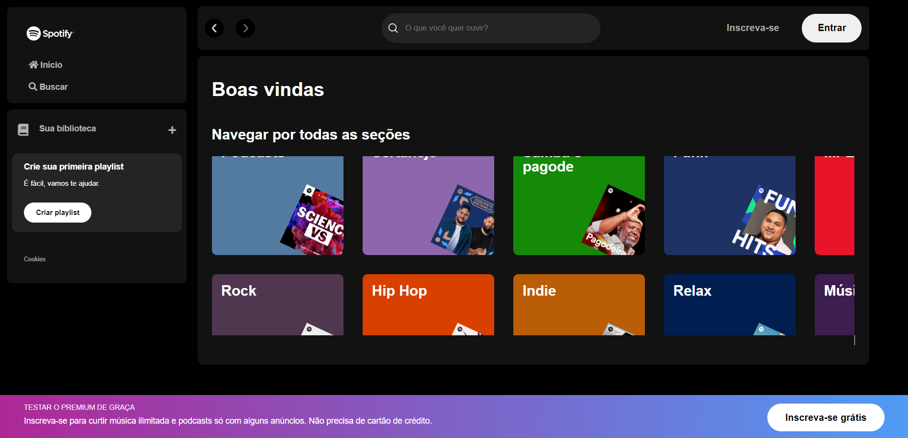

# Imersão Front-End Alura - 2024 - Clone 
## Tecnologias Usadas

* HTML 
* CSS 
* Javascript 
* Visual Studio
* Biblioteca Json-Server
* Consumindo API
* Grid e Flex

## Instrutores e instrutoras da alura nessa imersão
- Guilherme Lima - Alura
- Fernanda Degolin - Desenvolvedora Front-end na Globo
- Mayara Cardoso - Desenvolvedora Front-end no Itaú

Autora:
https://www.linkedin.com/in/mayaracapereira/

